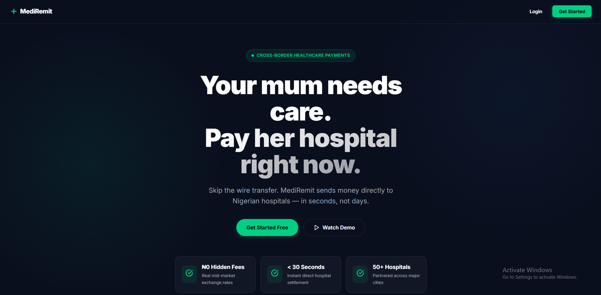
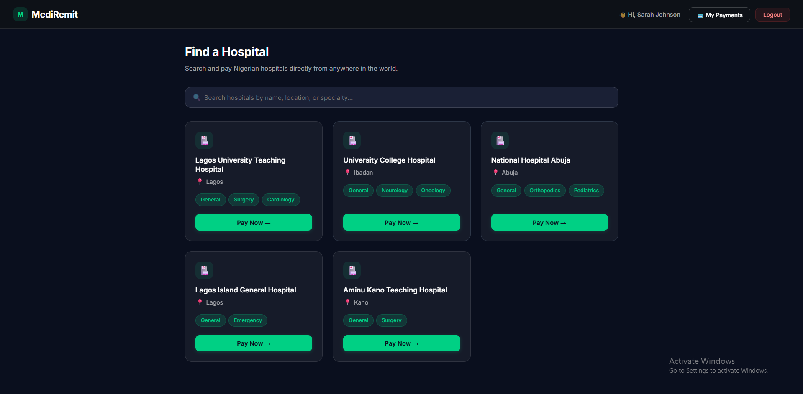
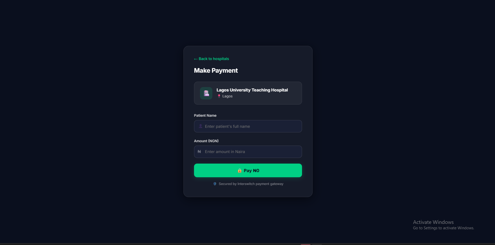
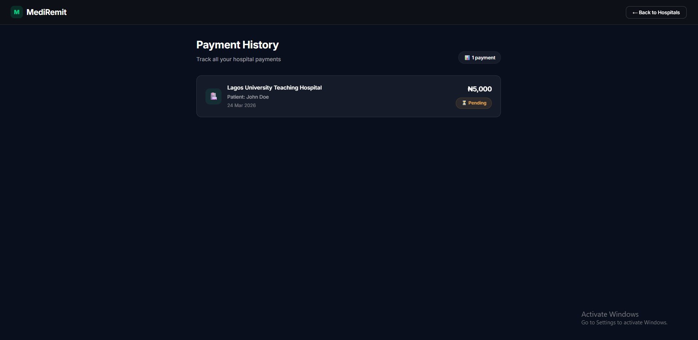

<p align="center">
  
</p>

<h1 align="center">🏥 MediRemit</h1>

<p align="center">
  <strong>Your mum needs care. Pay her hospital right now.</strong><br/>
  <em>Cross-border healthcare payments for the Nigerian diaspora.</em>
</p>

<p align="center">
  <a href="https://mediremit-frontend.vercel.app"></a>
  <a href="https://mediremit-backend.onrender.com"></a>
</p>

<p align="center">
  
  
  
  
  
  
  
  
</p>

---

## 🎯 What is MediRemit?

MediRemit is a cross-border healthcare payment platform that lets Nigerians in the diaspora **pay hospital bills directly** — bypassing middlemen, eliminating wire transfer delays, and ensuring every naira reaches the hospital. Built on **Interswitch's Web Checkout API**, payments settle instantly into verified hospital accounts.

---

## 💡 The Problem

Millions of Nigerians abroad send money home for medical bills through wire transfers that take 3–5 days, lose 5–10% in hidden fees, and offer zero guarantee the cash reaches the hospital. Families have no visibility, no receipts, and no peace of mind.

## ✅ The Solution

MediRemit eliminates the middleman entirely. Search our directory of 15 verified Nigerian hospitals, select a treatment category, enter the patient details, and pay directly via Interswitch — with live FX conversion, instant digital receipts, and full transaction tracking.

---

## ✨ Features

| Feature | Description |
|---|---|
| 🎨 **Animated Landing Page** | Dark premium UI with scroll animations, glassmorphism cards, and trust badges |
| 🔐 **User Authentication** | JWT-based registration & login with bcrypt password hashing |
| 🏥 **Hospital Directory** | Search 15 verified hospitals by name, location, or specialty with location filter pills |
| 💊 **Treatment Categories** | 7 categories: Consultation, Surgery, Drugs & Pharmacy, Emergency Care, Lab & Diagnostics, Physiotherapy, Dental Care |
| 💱 **Live FX Conversion** | Real-time NGN → USD/GBP rates via exchangerate-api.com |
| 📋 **Payment Summary** | Preview card showing hospital, patient, treatment, amount in NGN/USD/GBP before paying |
| 💳 **Interswitch Checkout** | Direct hospital payment via Interswitch Web Checkout API |
| 🧾 **Payment Receipt** | Callback page showing success/failure with transaction details |
| 📊 **Transaction History** | Full payment ledger with real-time status tracking (Successful / Pending / Failed) |
| 👤 **User Profile** | Dashboard with total spent, payment count, success rate, preferred hospital, and recent transactions |
| 📱 **Fully Responsive** | Mobile-first design with breakpoints at 900px, 768px, and 480px |

---

## 📸 Screenshots

<p align="center">
  
  
</p>
<p align="center">
  
  
</p>
<p align="center">
  
</p>

---

## 🛠️ Tech Stack

### Frontend

| Technology | Purpose |
|---|---|
| **React 19** | Component-based UI framework |
| **Vite** | Lightning-fast dev server & bundler |
| **React Router DOM** | Client-side routing (8 routes) |
| **Axios** | HTTP client for API communication |
| **Vercel** | Frontend deployment & CDN |

### Backend

| Technology | Purpose |
|---|---|
| **Node.js + Express** | REST API server |
| **Supabase (PostgreSQL)** | Managed database with realtime capabilities |
| **JWT + bcrypt** | Authentication & password security |
| **Render** | Backend deployment |

### Integrations

| Service | Usage |
|---|---|
| **Interswitch Web Checkout API** | Payment processing & settlement |
| **Interswitch OAuth 2.0** | Secure API authentication |
| **ExchangeRate API** | Live NGN → USD/GBP conversion |

---

## 📡 API Endpoints

### Authentication

| Method | Endpoint | Description |
|---|---|---|
| `POST` | `/auth/register` | Register a new user |
| `POST` | `/auth/login` | Login and receive JWT token |

### Hospitals

| Method | Endpoint | Description |
|---|---|---|
| `GET` | `/hospitals` | List all verified hospitals |
| `GET` | `/hospitals?search=lagos` | Search hospitals by name/location |
| `GET` | `/hospitals?location=Lagos` | Filter hospitals by city |
| `GET` | `/hospitals/:id` | Get single hospital details |

### Payments

| Method | Endpoint | Description |
|---|---|---|
| `POST` | `/checkout/pay` | Initiate Interswitch payment session |
| `GET` | `/checkout/callback` | Handle payment gateway callback |

### Transactions

| Method | Endpoint | Description |
|---|---|---|
| `POST` | `/transactions` | Record a new transaction |
| `GET` | `/transactions` | Get authenticated user's payment history |
| `PATCH` | `/transactions/:ref/status` | Update transaction status |

---

## 🗺️ Frontend Routes

| Route | Page |
|---|---|
| `/` | Landing page |
| `/login` | User login |
| `/register` | User registration |
| `/hospitals` | Hospital directory with search & filters |
| `/payment/:id` | Payment form with FX conversion |
| `/payment/callback` | Payment receipt (success/failure) |
| `/transactions` | Transaction history |
| `/profile` | User profile & stats dashboard |

---

## 🚀 Running Locally

### Prerequisites

- Node.js 18+
- npm or yarn
- Supabase account
- Interswitch sandbox credentials

### Backend

```bash
git clone https://github.com/Hillary3000-web/Root-Access-Hackathon.git
cd Root-Access-Hackathon
npm install
cp .env.example .env   # Add your environment variables
node index.js
```

### Frontend

```bash
cd mediremit-frontend
npm install
npm run dev
```

The frontend runs on `http://localhost:5173` and the backend on `http://localhost:3000`.

### Environment Variables

```env
PORT=3000
INTERSWITCH_CLIENT_ID=your_client_id
INTERSWITCH_SECRET_KEY=your_secret_key
INTERSWITCH_BASE_URL=https://qa.interswitchng.com
INTERSWITCH_MERCHANT_CODE=your_merchant_code
INTERSWITCH_PAYABLE_CODE=your_payable_code
JWT_SECRET=your_jwt_secret
SUPABASE_URL=your_supabase_url
SUPABASE_KEY=your_supabase_key
BASE_URL=https://mediremit-backend.onrender.com
```

---

## 🏗️ Architecture

```
┌──────────────────────┐       ┌──────────────────────┐
│   React + Vite       │◄─────►│   Express Backend    │
│   (Vercel)           │ REST  │   (Render)           │
└──────────────────────┘       └──────────┬───────────┘
                                          │
                          ┌───────────────┼───────────────┐
                          │               │               │
                   ┌──────▼──────┐ ┌──────▼──────┐ ┌──────▼──────┐
                   │  Supabase   │ │ Interswitch │ │ ExchangeRate│
                   │ PostgreSQL  │ │ Web Checkout│ │     API     │
                   └─────────────┘ └─────────────┘ └─────────────┘
```

---

## 👥 Team

| Name | Role |
|---|---|
| **Hillary Chukwuma Prince** | Backend Lead & Full Stack — Architecture, Interswitch API integration, frontend UI/UX, database design, deployment |
|---|---|
| **Samson Chimaraoke** | Technical Advisor & Architectural Designer |
|---|---|
---

## 🏆 Built For

<p align="center">
  
</p>

<p align="center">
  
  
  
</p>

---

<p align="center">
  <strong>MediRemit</strong> — Stop sending cash home and hoping. Pay the hospital directly.<br/>
  <sub>© 2026 MediRemit. All rights reserved.</sub>
</p>
